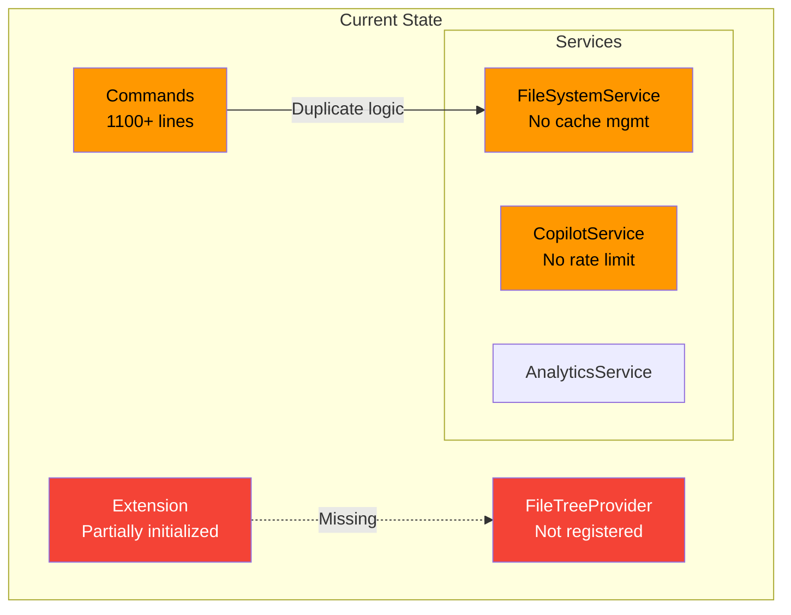
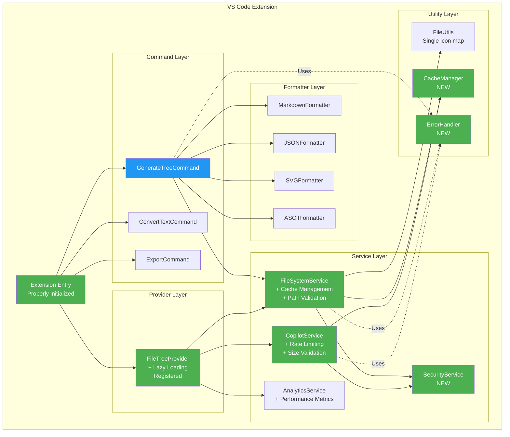
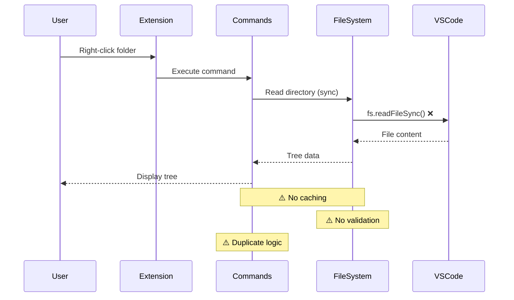
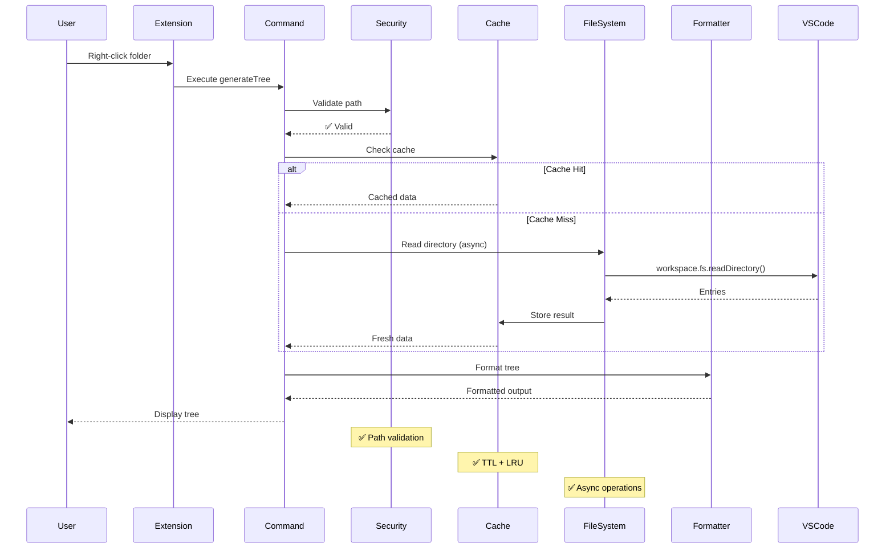
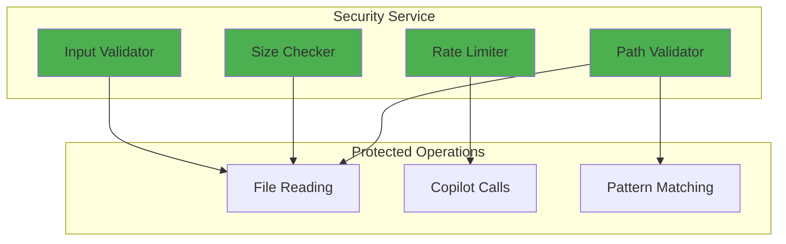
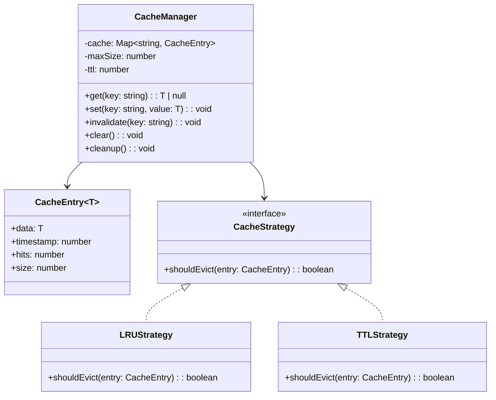
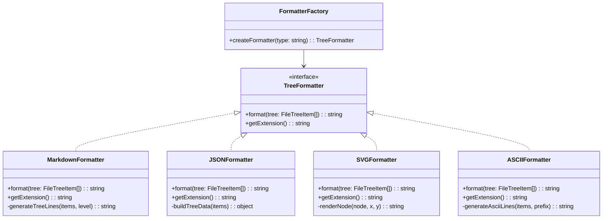
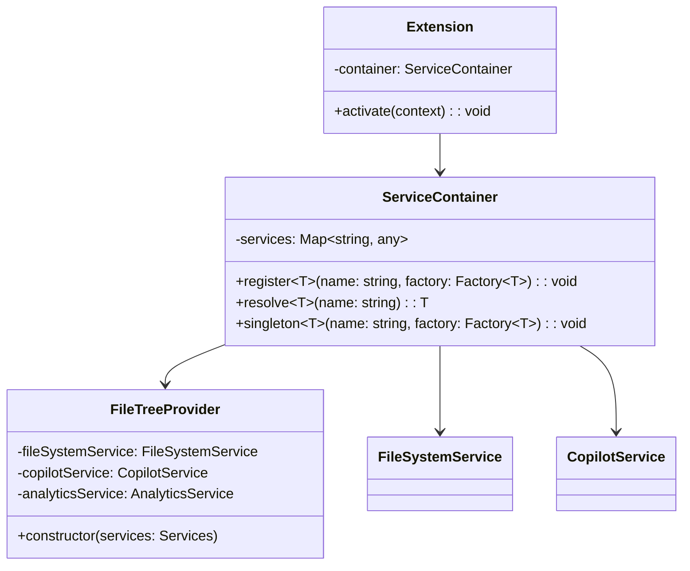
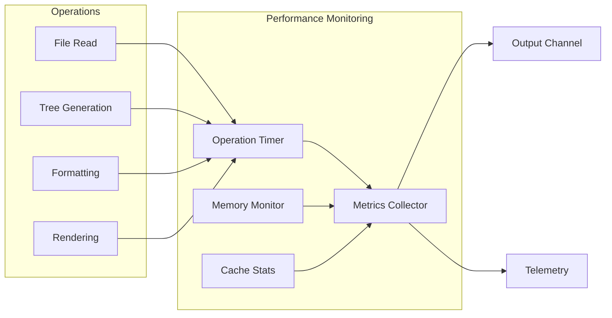

# 🏛️ FileTree Pro - Architecture Improvement Proposal

**Version:** 1.0
**Date:** October 17, 2025
**Status:** Proposed

---

## 📌 Overview

This document proposes architectural improvements to make FileTree Pro more scalable, maintainable, and production-ready.

---

## 🎯 Current vs. Proposed Architecture

### Current Architecture (As-Is)



### Proposed Architecture (To-Be)



---

## 📦 Proposed Module Structure

### Before (Current)

```
src/
├── extension.ts                 (45 lines)
├── extension-simple.ts          (13 lines) ❌ Unused
├── types.ts                     (165 lines)
├── commands/
│   └── commands.ts              (1106 lines) ⚠️ Too large!
├── providers/
│   └── fileTreeProvider.ts      (227 lines)
├── services/
│   ├── fileSystemService.ts     (242 lines)
│   ├── copilotService.ts        (239 lines)
│   └── analyticsService.ts      (276 lines)
└── utils/
    └── fileUtils.ts             (287 lines)
```

### After (Proposed)

```
src/
├── extension.ts                      (100 lines) ✅ Properly initialized
├── types/
│   ├── index.ts                      (Export all types)
│   ├── fileTree.types.ts
│   ├── service.types.ts
│   └── config.types.ts
├── commands/
│   ├── index.ts                      (Export all commands)
│   ├── generateTreeCommand.ts        (150 lines)
│   ├── convertTextCommand.ts         (80 lines)
│   └── exportCommand.ts              (100 lines)
├── formatters/
│   ├── index.ts                      (Export all formatters)
│   ├── markdownFormatter.ts          (200 lines)
│   ├── jsonFormatter.ts              (150 lines)
│   ├── svgFormatter.ts               (300 lines)
│   └── asciiFormatter.ts             (150 lines)
├── providers/
│   └── fileTreeProvider.ts           (250 lines) ✅ Enhanced
├── services/
│   ├── fileSystemService.ts          (300 lines) ✅ Enhanced
│   ├── copilotService.ts             (280 lines) ✅ Enhanced
│   ├── analyticsService.ts           (280 lines)
│   └── securityService.ts            (150 lines) ✨ NEW
├── utils/
│   ├── fileUtils.ts                  (300 lines)
│   ├── errorHandler.ts               (100 lines) ✨ NEW
│   ├── cacheManager.ts               (150 lines) ✨ NEW
│   └── securityUtils.ts              (100 lines) ✨ NEW
└── __tests__/
    ├── unit/
    │   ├── services.test.ts
    │   ├── commands.test.ts
    │   └── utils.test.ts
    ├── integration/
    │   └── extension.test.ts
    └── fixtures/
        └── sample-projects/
```

---

## 🔄 Data Flow Improvements

### Current Data Flow (Problematic)



### Proposed Data Flow (Improved)



---

## 🛡️ Security Layer Architecture



**Implementation:**

```typescript
// src/services/securityService.ts
export class SecurityService {
  private rateLimiter = new RateLimiter();

  async validateOperation(
    operation: 'read' | 'analyze' | 'pattern',
    context: OperationContext
  ): Promise<ValidationResult> {
    switch (operation) {
      case 'read':
        return this.validateFileRead(context);
      case 'analyze':
        return this.validateAnalysis(context);
      case 'pattern':
        return this.validatePattern(context);
    }
  }

  private validateFileRead(context: OperationContext): ValidationResult {
    // 1. Check path is in workspace
    if (!this.isPathInWorkspace(context.uri)) {
      return { valid: false, reason: 'Path outside workspace' };
    }

    // 2. Check file size
    if (context.size && context.size > this.MAX_FILE_SIZE) {
      return { valid: false, reason: 'File too large' };
    }

    return { valid: true };
  }

  private validateAnalysis(context: OperationContext): ValidationResult {
    // 1. Check rate limit
    if (!this.rateLimiter.checkLimit('copilot')) {
      return { valid: false, reason: 'Rate limit exceeded' };
    }

    // 2. Check file size
    if (context.size && context.size > this.MAX_ANALYSIS_SIZE) {
      return { valid: false, reason: 'File too large for analysis' };
    }

    this.rateLimiter.recordCall('copilot');
    return { valid: true };
  }
}
```

---

## 💾 Cache Management Architecture



**Implementation:**

```typescript
// src/utils/cacheManager.ts
export class CacheManager<T> {
  private cache = new Map<string, CacheEntry<T>>();
  private readonly maxSize: number;
  private readonly ttl: number;

  constructor(config: CacheConfig) {
    this.maxSize = config.maxSize || 1000;
    this.ttl = config.ttl || 5 * 60 * 1000; // 5 minutes

    // Auto-cleanup every minute
    setInterval(() => this.cleanup(), 60000);
  }

  get(key: string): T | null {
    const entry = this.cache.get(key);

    if (!entry) {
      return null;
    }

    // Check TTL
    if (Date.now() - entry.timestamp > this.ttl) {
      this.cache.delete(key);
      return null;
    }

    // Update hit count
    entry.hits++;
    return entry.data;
  }

  set(key: string, value: T): void {
    // Enforce size limit
    if (this.cache.size >= this.maxSize) {
      this.evictLRU();
    }

    this.cache.set(key, {
      data: value,
      timestamp: Date.now(),
      hits: 0,
      size: this.estimateSize(value),
    });
  }

  private evictLRU(): void {
    // Find entry with lowest hit count
    let minHits = Infinity;
    let keyToEvict: string | null = null;

    for (const [key, entry] of this.cache.entries()) {
      if (entry.hits < minHits) {
        minHits = entry.hits;
        keyToEvict = key;
      }
    }

    if (keyToEvict) {
      this.cache.delete(keyToEvict);
    }
  }

  cleanup(): void {
    const now = Date.now();

    for (const [key, entry] of this.cache.entries()) {
      if (now - entry.timestamp > this.ttl) {
        this.cache.delete(key);
      }
    }
  }

  getStats(): CacheStats {
    let totalSize = 0;
    let totalHits = 0;

    for (const entry of this.cache.values()) {
      totalSize += entry.size;
      totalHits += entry.hits;
    }

    return {
      entries: this.cache.size,
      totalSize,
      totalHits,
      hitRate: totalHits / Math.max(1, this.cache.size),
    };
  }
}
```

---

## 🎨 Formatter Pattern Implementation



**Implementation:**

```typescript
// src/formatters/treeFormatter.interface.ts
export interface TreeFormatter {
  format(tree: FileTreeItem[], options: FormatOptions): string;
  getExtension(): string;
  getLanguageId(): string;
}

// src/formatters/formatterFactory.ts
export class FormatterFactory {
  private formatters = new Map<string, TreeFormatter>();

  constructor() {
    this.formatters.set('markdown', new MarkdownFormatter());
    this.formatters.set('json', new JSONFormatter());
    this.formatters.set('svg', new SVGFormatter());
    this.formatters.set('ascii', new ASCIIFormatter());
  }

  createFormatter(type: string): TreeFormatter {
    const formatter = this.formatters.get(type.toLowerCase());

    if (!formatter) {
      throw new Error(`Unknown formatter type: ${type}`);
    }

    return formatter;
  }

  getAvailableFormats(): string[] {
    return Array.from(this.formatters.keys());
  }
}

// Usage in command
const factory = new FormatterFactory();
const formatter = factory.createFormatter(formatChoice.value);
const output = formatter.format(tree, options);
```

---

## 🔌 Dependency Injection Container



**Implementation:**

```typescript
// src/core/serviceContainer.ts
export class ServiceContainer {
  private services = new Map<string, any>();
  private singletons = new Map<string, any>();

  register<T>(name: string, factory: () => T): void {
    this.services.set(name, factory);
  }

  singleton<T>(name: string, factory: () => T): void {
    this.singletons.set(name, factory);
  }

  resolve<T>(name: string): T {
    // Check singleton first
    if (this.singletons.has(name)) {
      const factory = this.singletons.get(name);
      if (!this.services.has(`singleton:${name}`)) {
        this.services.set(`singleton:${name}`, factory());
      }
      return this.services.get(`singleton:${name}`);
    }

    // Create new instance
    const factory = this.services.get(name);
    if (!factory) {
      throw new Error(`Service not registered: ${name}`);
    }

    return factory();
  }
}

// Usage in extension.ts
export function activate(context: vscode.ExtensionContext) {
  const container = new ServiceContainer();

  // Register services as singletons
  container.singleton('fileSystemService', () => new FileSystemService());
  container.singleton('copilotService', () => new CopilotService());
  container.singleton('analyticsService', () => new AnalyticsService());
  container.singleton('securityService', () => new SecurityService());
  container.singleton('cacheManager', () => new CacheManager({ maxSize: 1000, ttl: 300000 }));

  // Register provider
  container.register('fileTreeProvider', () => {
    return new FileTreeProvider(
      container.resolve('fileSystemService'),
      container.resolve('copilotService'),
      container.resolve('analyticsService')
    );
  });

  // Create and register Tree View
  const provider = container.resolve<FileTreeProvider>('fileTreeProvider');
  const treeView = vscode.window.createTreeView('fileTreeView', {
    treeDataProvider: provider,
  });

  context.subscriptions.push(treeView);
}
```

---

## 📊 Performance Monitoring



**Implementation:**

```typescript
// src/utils/performanceMonitor.ts
export class PerformanceMonitor {
  private metrics = new Map<string, OperationMetrics>();

  startOperation(name: string): PerformanceTimer {
    return new PerformanceTimer(name, this);
  }

  recordOperation(name: string, duration: number, memoryDelta: number): void {
    const existing = this.metrics.get(name) || {
      count: 0,
      totalDuration: 0,
      avgDuration: 0,
      minDuration: Infinity,
      maxDuration: 0,
      totalMemory: 0,
    };

    existing.count++;
    existing.totalDuration += duration;
    existing.avgDuration = existing.totalDuration / existing.count;
    existing.minDuration = Math.min(existing.minDuration, duration);
    existing.maxDuration = Math.max(existing.maxDuration, duration);
    existing.totalMemory += memoryDelta;

    this.metrics.set(name, existing);
  }

  getReport(): PerformanceReport {
    const report: PerformanceReport = {
      operations: [],
      totalOperations: 0,
      totalTime: 0,
    };

    for (const [name, metrics] of this.metrics.entries()) {
      report.operations.push({ name, ...metrics });
      report.totalOperations += metrics.count;
      report.totalTime += metrics.totalDuration;
    }

    return report;
  }
}

class PerformanceTimer {
  private startTime: number;
  private startMemory: number;

  constructor(
    private name: string,
    private monitor: PerformanceMonitor
  ) {
    this.startTime = performance.now();
    this.startMemory = process.memoryUsage().heapUsed;
  }

  end(): void {
    const duration = performance.now() - this.startTime;
    const memoryDelta = process.memoryUsage().heapUsed - this.startMemory;

    this.monitor.recordOperation(this.name, duration, memoryDelta);
  }
}

// Usage
const monitor = new PerformanceMonitor();

async function generateTree() {
  const timer = monitor.startOperation('generateTree');

  try {
    // ... tree generation logic
  } finally {
    timer.end();
  }
}
```

---

## 🚀 Migration Plan

### Phase 1: Critical Fixes (Week 1)

1. ✅ Fix extension initialization
2. ✅ Add security service
3. ✅ Implement cache manager
4. ✅ Add error handler
5. ✅ Remove code duplication

### Phase 2: Refactoring (Week 2-3)

1. ✅ Split commands.ts into modules
2. ✅ Extract formatters
3. ✅ Implement service container
4. ✅ Add performance monitoring
5. ✅ Write comprehensive tests

### Phase 3: Enhancements (Week 4+)

1. ✅ Add lazy loading to Tree View
2. ✅ Implement incremental updates
3. ✅ Add telemetry (opt-in)
4. ✅ Optimize for large projects
5. ✅ Add custom templates

---

## ✅ Success Criteria

After implementing these improvements:

- ✅ Extension properly initialized on activation
- ✅ All services registered and functional
- ✅ Security layer protects all operations
- ✅ Cache system prevents memory leaks
- ✅ Error handling is consistent
- ✅ Code duplication eliminated
- ✅ Test coverage > 80%
- ✅ Performance improved by 30%+
- ✅ Memory usage reduced by 40%+

---

## 📚 References

- [VS Code Extension API](https://code.visualstudio.com/api)
- [TypeScript Best Practices](https://www.typescriptlang.org/docs/handbook/declaration-files/do-s-and-don-ts.html)
- [SOLID Principles](https://en.wikipedia.org/wiki/SOLID)
- [Design Patterns](https://refactoring.guru/design-patterns)

---

**Proposal Status:** Ready for Implementation
**Estimated Effort:** 3-4 weeks
**Priority:** High
