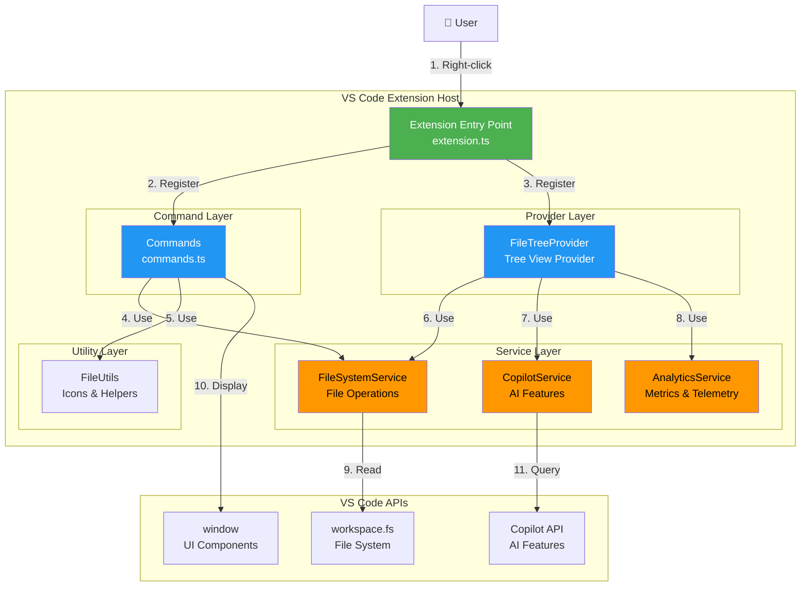
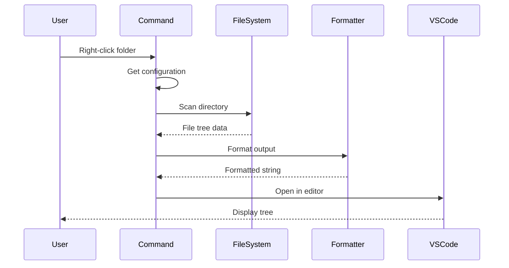
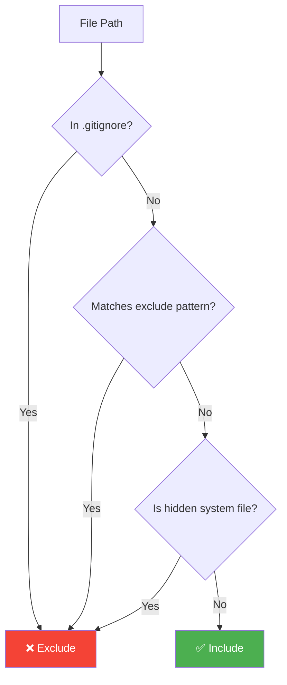
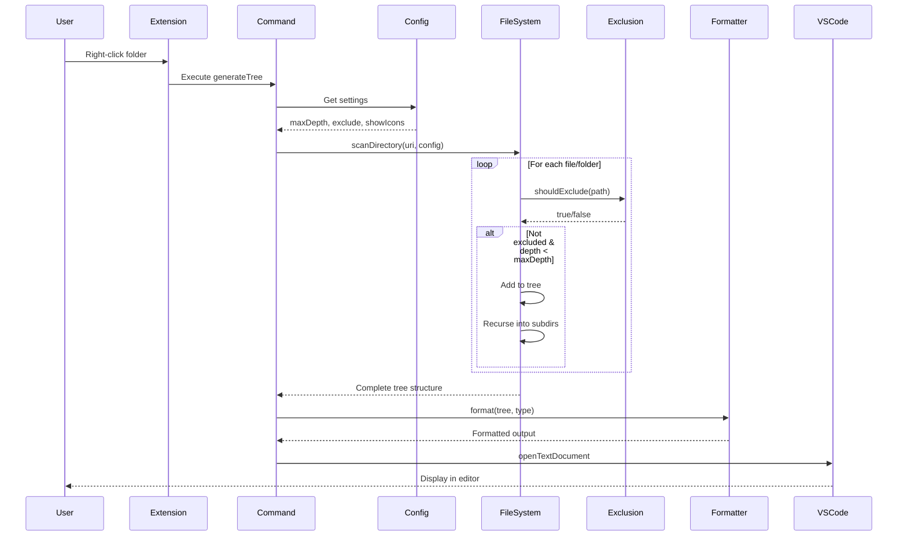
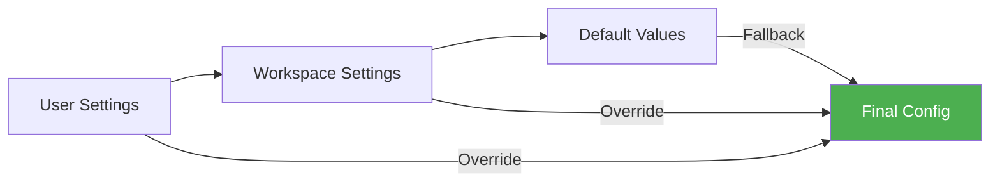
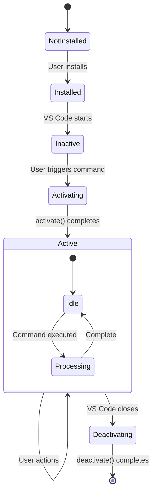

# 🏗️ FileTree Pro - Architecture Documentation

**Version:** 0.2.0
**Last Updated:** October 17, 2025
**Status:** Production

---

## 📋 Table of Contents

1. [Overview](#-overview)
2. [High-Level Architecture](#-high-level-architecture)
3. [Component Breakdown](#-component-breakdown)
4. [Data Flow](#-data-flow)
5. [Configuration System](#-configuration-system)
6. [Service Layer](#-service-layer)
7. [Performance & Optimization](#-performance--optimization)
8. [Extension Lifecycle](#-extension-lifecycle)
9. [Security & Validation](#-security--validation)
10. [Future Improvements](#-future-improvements)

---

## 🎯 Overview

**FileTree Pro** is a VS Code extension that generates interactive file trees with smart exclusions, multiple export formats, and optional AI features via GitHub Copilot integration.

### Core Principles

- 🎯 **Simplicity First**: Works out-of-the-box with sensible defaults
- 🚀 **Performance**: Handles large projects (10,000+ files) efficiently
- 🔒 **Security**: All processing happens locally using VS Code APIs
- 🎨 **Flexibility**: Multiple formats (Markdown, JSON, SVG, ASCII)
- 🌍 **Universal**: Supports all programming languages

### Key Features

| Feature              | Description                           | Status    |
| -------------------- | ------------------------------------- | --------- |
| File Tree Generation | Right-click folder → Generate tree    | ✅ Active |
| Text to Tree         | Convert text to tree format           | ✅ Active |
| Multiple Formats     | MD, JSON, SVG, ASCII                  | ✅ Active |
| Smart Exclusions     | Auto-exclude node_modules, dist, etc. | ✅ Active |
| .gitignore Support   | Respect .gitignore patterns           | ✅ Active |
| Depth Control        | Configure scan depth (1-99)           | ✅ Active |
| Icon Support         | File/folder icons                     | ✅ Active |
| Copilot Integration  | Optional AI features                  | ✅ Active |

---

## 🏛️ High-Level Architecture



---

## 📦 Component Breakdown

### 1. **Extension Entry Point** (`src/extension.ts`)

**Purpose:** Initialize extension and register all components

**Key Responsibilities:**

- ✅ Register commands with VS Code
- ✅ Initialize service instances
- ✅ Register Tree View provider
- ✅ Set up event handlers
- ✅ Manage extension lifecycle

**Code Structure:**

```typescript
export async function activate(context: vscode.ExtensionContext) {
  // 1. Initialize services
  const fileSystemService = new FileSystemService();
  const copilotService = new CopilotService();
  const analyticsService = new AnalyticsService(context);

  // 2. Create service container
  const serviceContainer = new ServiceContainer(
    fileSystemService,
    copilotService,
    analyticsService
  );

  // 3. Register commands
  const generateCommand = vscode.commands.registerCommand('filetree-pro.generateTree', uri =>
    generateFileTree(uri, serviceContainer)
  );

  // 4. Register Tree View provider
  const treeProvider = new FileTreeProvider(serviceContainer);
  const treeView = vscode.window.createTreeView('fileTreeView', {
    treeDataProvider: treeProvider,
  });

  // 5. Add to subscriptions
  context.subscriptions.push(generateCommand, treeView);
}

export function deactivate() {
  // Cleanup resources
}
```

---

### 2. **Command Layer** (`src/commands/commands.ts`)

**Purpose:** Handle user actions and orchestrate operations

**Commands:**

| Command             | Trigger                   | Action             |
| ------------------- | ------------------------- | ------------------ |
| `generateTree`      | Right-click folder        | Generate file tree |
| `convertTextToTree` | Select text + right-click | Convert to tree    |
| `refreshTree`       | Refresh button            | Regenerate tree    |
| `exportTree`        | Export button             | Export in format   |

**Flow:**



---

### 3. **Provider Layer** (`src/providers/fileTreeProvider.ts`)

**Purpose:** Power the Tree View in VS Code sidebar

**Key Features:**

- ✅ Lazy loading for performance
- ✅ Dynamic updates on file changes
- ✅ Expandable/collapsible nodes
- ✅ Icon support

**Implementation:**

```typescript
export class FileTreeProvider implements vscode.TreeDataProvider<FileTreeItem> {
  private _onDidChangeTreeData = new vscode.EventEmitter<FileTreeItem | undefined>();
  readonly onDidChangeTreeData = this._onDidChangeTreeData.event;

  constructor(private serviceContainer: ServiceContainer) {}

  refresh(): void {
    this._onDidChangeTreeData.fire(undefined);
  }

  getTreeItem(element: FileTreeItem): vscode.TreeItem {
    return element;
  }

  async getChildren(element?: FileTreeItem): Promise<FileTreeItem[]> {
    // Lazy load children
    if (!element) {
      return this.getRootItems();
    }
    return this.getChildItems(element);
  }
}
```

---

### 4. **Service Layer**

#### **FileSystemService** (`src/services/fileSystemService.ts`)

**Purpose:** Handle all file system operations

**Key Methods:**

```typescript
class FileSystemService {
  // Read directory recursively
  async readDirectory(
    uri: vscode.Uri,
    depth: number,
    maxDepth: number,
    excludePatterns: string[]
  ): Promise<FileTreeItem[]>;

  // Check if file should be excluded
  shouldExclude(path: string, excludePatterns: string[]): boolean;

  // Get file stats
  async getFileStat(uri: vscode.Uri): Promise<FileStat>;

  // Parse .gitignore
  async parseGitignore(rootUri: vscode.Uri): Promise<string[]>;
}
```

**Exclusion Logic:**



#### **CopilotService** (`src/services/copilotService.ts`)

**Purpose:** Integrate with GitHub Copilot for AI features

**Features:**

- ✅ File summarization
- ✅ Organization suggestions
- ✅ Pattern recognition

**Implementation:**

```typescript
class CopilotService {
  async isAvailable(): Promise<boolean> {
    const copilot = vscode.extensions.getExtension('github.copilot');
    return copilot !== undefined && copilot.isActive;
  }

  async analyzeFileTree(tree: FileTreeItem[]): Promise<Analysis> {
    if (!(await this.isAvailable())) {
      return { available: false };
    }

    // Use Copilot Chat API
    const analysis = await this.queryCopilot(tree);
    return analysis;
  }
}
```

#### **AnalyticsService** (`src/services/analyticsService.ts`)

**Purpose:** Track usage and performance metrics

**Metrics Tracked:**

- ⏱️ Tree generation time
- 📊 File counts
- 🎨 Format usage
- 🔍 Exclusion patterns
- 💾 Memory usage

---

### 5. **Utility Layer** (`src/utils/fileUtils.ts`)

**Purpose:** Helper functions and icon mapping

**Key Features:**

```typescript
// Icon mapping
const FILE_ICONS: Record<string, string> = {
  // JavaScript
  '.js': '📜',
  '.ts': '📘',
  '.jsx': '⚛️',
  '.tsx': '⚛️',

  // Python
  '.py': '🐍',
  '.pyi': '🐍',

  // Web
  '.html': '🌐',
  '.css': '🎨',
  '.scss': '🎨',

  // ... 50+ file types
};

// Get icon for file
export function getFileIcon(filename: string): string {
  const ext = path.extname(filename).toLowerCase();
  return FILE_ICONS[ext] || '📄';
}

// Convert glob pattern to regex
export function globToRegex(pattern: string): RegExp {
  // ** → .* (match anything)
  // * → [^/]* (match anything except /)
  // ? → [^/] (match single char)
}
```

---

## 🔄 Data Flow

### Complete Request Flow



---

## ⚙️ Configuration System

### Configuration Schema

**Location:** `package.json` → `contributes.configuration`

```json
{
  "filetree-pro.maxDepth": {
    "type": "number",
    "default": 10,
    "minimum": 1,
    "maximum": 99,
    "description": "Maximum depth to scan when generating file trees"
  },
  "filetree-pro.exclude": {
    "type": "array",
    "default": ["**/node_modules/**", "**/dist/**", "**/.git/**"],
    "description": "Glob patterns to exclude"
  },
  "filetree-pro.showIcons": {
    "type": "boolean",
    "default": true,
    "description": "Show file/folder icons"
  },
  "filetree-pro.respectGitignore": {
    "type": "boolean",
    "default": true,
    "description": "Respect .gitignore patterns"
  }
}
```

### Configuration Priority



**Priority Order:**

1. 🥇 **Workspace Settings** (`.vscode/settings.json`)
2. 🥈 **User Settings** (Global settings)
3. 🥉 **Default Values** (package.json)

---

## 📊 Performance & Optimization

### Depth Control Strategy

**Why Depth Matters:**

| Depth | Files Scanned | Time    | Memory | Use Case      |
| ----- | ------------- | ------- | ------ | ------------- |
| 2     | ~50           | < 100ms | ~5MB   | README docs   |
| 5     | ~500          | < 500ms | ~20MB  | Code reviews  |
| 10    | ~5,000        | 1-3s    | ~100MB | Full analysis |
| 20    | ~50,000       | 10-30s  | ~500MB | ⚠️ Risky      |

### Optimization Techniques

**1. Lazy Loading**

```typescript
// Only scan directories when expanded
async getChildren(element?: FileTreeItem): Promise<FileTreeItem[]> {
  if (!element) {
    return this.getRootItems(); // Only root level
  }
  return this.loadChildren(element); // Load on demand
}
```

**2. Async Processing**

```typescript
// Non-blocking file system operations
const entries = await vscode.workspace.fs.readDirectory(uri);
```

**3. Smart Exclusions**

```typescript
// Early exit for common exclusions
const quickExclusions = ['node_modules', '.git', 'dist'];
if (quickExclusions.some(e => path.includes(e))) {
  return true; // Skip expensive regex checks
}
```

**4. Batch Processing**

```typescript
// Process files in chunks to avoid blocking
const BATCH_SIZE = 100;
for (let i = 0; i < files.length; i += BATCH_SIZE) {
  const batch = files.slice(i, i + BATCH_SIZE);
  await processBatch(batch);

  // Yield to event loop
  await new Promise(resolve => setImmediate(resolve));
}
```

---

## 🔄 Extension Lifecycle

### Activation Flow



### Activation Events

**From `package.json`:**

```json
{
  "activationEvents": [
    "onCommand:filetree-pro.generateTree",
    "onCommand:filetree-pro.convertTextToTree",
    "onView:fileTreeView"
  ]
}
```

**Lazy Activation:**

- Extension only loads when user needs it
- Reduces VS Code startup time
- Conserves memory

---

## 🔒 Security & Validation

### Path Validation

**Security Checks:**

```typescript
function validatePath(uri: vscode.Uri): boolean {
  // 1. Must be in workspace
  const workspaceFolder = vscode.workspace.getWorkspaceFolder(uri);
  if (!workspaceFolder) {
    return false;
  }

  // 2. No path traversal
  const normalizedPath = path.normalize(uri.fsPath);
  if (normalizedPath.includes('..')) {
    return false;
  }

  // 3. Not a system directory
  const systemDirs = ['/System', '/Windows', '/etc'];
  if (systemDirs.some(d => normalizedPath.startsWith(d))) {
    return false;
  }

  return true;
}
```

### Input Sanitization

```typescript
function sanitizePattern(pattern: string): string {
  // Remove dangerous characters
  return pattern.replace(/[;&|<>$`]/g, '').replace(/\.\./g, '');
}
```

### File Size Limits

```typescript
const MAX_FILE_SIZE = 10 * 1024 * 1024; // 10 MB
const MAX_DIRECTORY_SIZE = 100 * 1024 * 1024; // 100 MB

async function checkSize(uri: vscode.Uri): Promise<boolean> {
  const stat = await vscode.workspace.fs.stat(uri);
  return stat.size <= MAX_FILE_SIZE;
}
```

---

## 🚀 Future Improvements

### Planned Enhancements

**Phase 1: Core Improvements** (v0.3.0)

- [ ] Cache management for faster reloads
- [ ] Interactive depth picker UI
- [ ] Per-folder depth overrides
- [ ] Export presets (monorepo, docs, full)

**Phase 2: Advanced Features** (v0.4.0)

- [ ] Tree diff comparison
- [ ] Custom icon packs
- [ ] Tree filtering/search
- [ ] Multi-format export

**Phase 3: Team Features** (v0.5.0)

- [ ] Shared configurations
- [ ] Team presets
- [ ] Git integration (show changes)
- [ ] Collaborative annotations

### Architecture Improvements

**Proposed Changes:**

1. **Service Container Pattern**
   - Dependency injection
   - Better testability
   - Cleaner separation

2. **Cache Layer**
   - LRU cache for file trees
   - TTL-based invalidation
   - Persistent storage option

3. **Plugin System**
   - Custom formatters
   - Custom exclusion rules
   - Extension points

---

## 📚 Additional Resources

### Documentation

- **[Configuration Guide](./CONFIGURATION-GUIDE.md)** - Complete configuration reference
- **[Quick Start](./CONFIG-QUICK-START.md)** - Get started quickly
- **[Changelog](../CHANGELOG.md)** - Version history

### For Contributors

- **[Architecture Proposal](./ARCHITECTURE_PROPOSAL.md)** - Detailed improvement plans
- **[Testing Guide](./TESTING.md)** - How to test the extension
- **[Development Setup](./DEVELOPMENT.md)** - Local development guide

### External Links

- **[VS Code Extension API](https://code.visualstudio.com/api)** - Official API docs
- **[GitHub Repository](https://github.com/0xTanzim/filetree-pro)** - Source code
- **[Marketplace](https://marketplace.visualstudio.com/items?itemName=0xtanzim.filetree-pro)** - Extension page

---

## 🤝 Contributing

We welcome contributions! See the architecture proposal for improvement ideas.

**Key Areas:**

- 🐛 Bug fixes
- ⚡ Performance optimization
- 📚 Documentation improvements
- ✨ New features (discuss first)

---

## 📞 Support

- **Issues:** [GitHub Issues](https://github.com/0xTanzim/filetree-pro/issues)
- **Email:** tanzimhossain2@gmail.com
- **Discussions:** [GitHub Discussions](https://github.com/0xTanzim/filetree-pro/discussions)

---

**Built with ❤️ for the open source community**

_Last updated: October 17, 2025_
