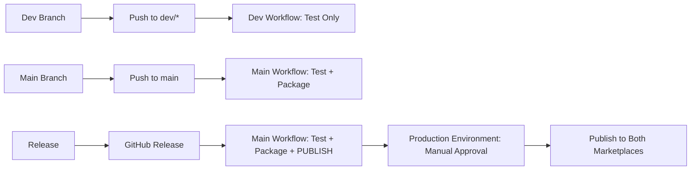

# 🔧 CI/CD Pipeline Fixes Applied

## ✅ **Issues Fixed**

### **1. Workflow Trigger Cleanup**

**Before:**

```yaml
on:
  push:
    branches:
      - main
      - 'dev/*' # ❌ Unnecessary - only needed testing
      - 'v2/*' # ❌ Unnecessary - only needed testing
```

**After:**

```yaml
on:
  push:
    branches:
      - main # ✅ Only main branch triggers full pipeline
  pull_request:
    branches:
      - main # ✅ Only PRs to main run full tests
```

### **2. Separated Development Workflow**

Created **separate workflow** (`dev.yml`) for development branches:

- `dev/*` branches → Only runs tests (no packaging/publishing)
- `feature/*` branches → Only runs tests
- `v2/*` branches → Only runs tests
- Clear messaging that no publishing happens from dev branches

### **3. Enhanced Safety & Clarity**

- ✅ More explicit conditions in package job
- ✅ Better logging in publish job
- ✅ Clear separation of concerns between workflows
- ✅ Added verification steps in publish job

## 🛡️ **Security Improvements**

### **Publishing Safety**

```yaml
# Publishing ONLY happens on:
if: github.event_name == 'release' && github.event.action == 'published'
environment: production # Requires manual approval
```

### **Branch Isolation**

- **Main workflow**: Only `main` branch + releases
- **Dev workflow**: Only development branches
- **No cross-contamination** between production and development workflows

## 📊 **Workflow Behavior Summary**

| Event             | Main Workflow (build.yml)       | Dev Workflow (dev.yml) |
| ----------------- | ------------------------------- | ---------------------- |
| `push: main`      | ✅ Test + Package               | ❌ No                  |
| `push: dev/*`     | ❌ No                           | ✅ Test Only           |
| `push: feature/*` | ❌ No                           | ✅ Test Only           |
| `PR to main`      | ✅ Test Only                    | ❌ No                  |
| `PR to dev/*`     | ❌ No                           | ✅ Test Only           |
| `release`         | ✅ Test + Package + **PUBLISH** | ❌ No                  |

## 🎯 **Benefits**

1. **🔐 Safer**: No accidental publishing from dev branches
2. **⚡ Faster**: Dev branches only run necessary tests
3. **📝 Clearer**: Explicit about when publishing happens
4. **🧹 Cleaner**: Separated concerns between production and development
5. **🛡️ More Secure**: Production environment with approval gates

## 🚀 **Publishing Flow**



## ✨ **Result**

Your CI/CD pipeline is now:

- **🔒 Bulletproof**: Publishing only on releases with manual approval
- **🚀 Efficient**: Appropriate testing for each branch type
- **📖 Clear**: Obvious when and how publishing happens
- **🛡️ Safe**: No risk of accidental publishing from development

---

**Ready to test!** Push to your `dev/fix` branch - it will only run tests via the dev workflow. 🎉
