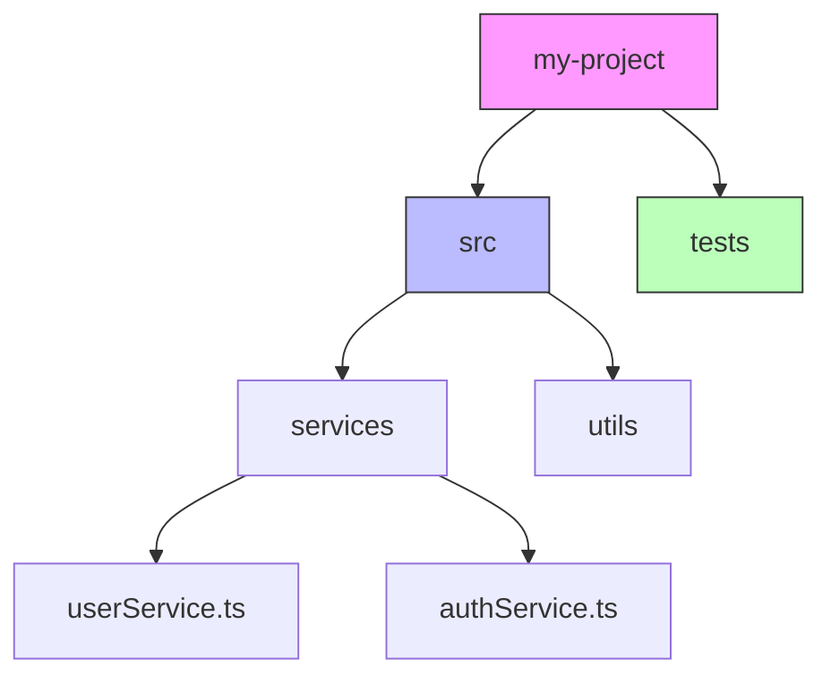

# 🚀 New Features & Innovations - FileTree Pro

**Date:** October 17, 2025
**Status:** 📝 PROPOSAL
**Based On:** VS Code 2025 API + GitHub Copilot Integration

---

## Table of Contents

1. [Priority 1: Chat Participant Integration](#priority-1-chat-participant-integration)
2. [Priority 2: Inline Chat Actions](#priority-2-inline-chat-actions)
3. [Priority 3: Mermaid Diagram Export](#priority-3-mermaid-diagram-export)
4. [Priority 4: Interactive Tree View](#priority-4-interactive-tree-view)
5. [Priority 5: Git-Aware Trees](#priority-5-git-aware-trees)
6. [Additional Features](#additional-features)

---

## Priority 1: Chat Participant Integration ⭐⭐⭐⭐⭐

### Overview

Add `@filetree` participant to GitHub Copilot Chat, allowing users to ask natural language questions about project structure.

### User Experience

**Example Conversations:**

```
User: "@filetree, show me all TypeScript files in the project"
FileTree: "Here are all TypeScript files:
├── src/
│   ├── extension.ts
│   ├── services/
│   │   ├── fileSystemService.ts
│   │   ├── exclusionService.ts
│   │   └── ...
```

```
User: "@filetree, why is my project so big?"
FileTree: "Your project is 2.3GB because:
• node_modules: 1.8GB (86 packages)
• dist/: 500MB (compiled code)
• .git/: 200MB (repository history)

💡 Suggestion: Add node_modules to .gitignore"
```

```
User: "@filetree, where should I put my new API service?"
FileTree: "Based on your current structure, I recommend:
📂 src/
  └── services/
     └── apiService.ts  ← Here!

Your project follows a services pattern. All services are in src/services/."
```

### Implementation

**File:** `src/features/chatParticipant.ts`

```typescript
import * as vscode from 'vscode';

export function registerChatParticipant(
  context: vscode.ExtensionContext,
  treeBuilderService: TreeBuilderService,
  copilotService: CopilotService
): vscode.Disposable {
  // ✅ Register @filetree participant
  return vscode.chat.registerChatParticipant(
    'filetree',
    async (
      request: vscode.ChatRequest,
      context: vscode.ChatContext,
      stream: vscode.ChatResponseStream,
      token: vscode.CancellationToken
    ) => {
      const query = request.prompt;
      const workspaceFolder = vscode.workspace.workspaceFolders?.[0];

      if (!workspaceFolder) {
        stream.markdown('No workspace folder open. Please open a folder first.');
        return;
      }

      // Understand user intent
      if (query.includes('show') || query.includes('list') || query.includes('structure')) {
        // Generate tree structure
        const items = await treeBuilderService.buildFileTreeItems(
          workspaceFolder.uri.fsPath,
          3, // Shallow depth for chat
          workspaceFolder.uri.fsPath,
          0,
          undefined,
          token
        );

        const tree = formatTreeForChat(items);
        stream.markdown(`\n\`\`\`\n${tree}\n\`\`\`\n`);
      } else if (query.includes('size') || query.includes('big') || query.includes('large')) {
        // Analyze project size
        const stats = await getProjectStats(workspaceFolder.uri.fsPath);

        stream.markdown(`## Project Size Analysis\n\n`);
        stream.markdown(`**Total Size:** ${stats.totalSize}\n`);
        stream.markdown(`**Files:** ${stats.fileCount}\n\n`);
        stream.markdown(`### Largest Folders:\n`);

        for (const folder of stats.largestFolders) {
          stream.markdown(`- \`${folder.name}\`: ${folder.size}\n`);
        }
      } else if (query.includes('where') || query.includes('should i put')) {
        // Use Copilot to suggest file location
        const context = await getProjectContext(workspaceFolder.uri.fsPath);
        const suggestion = await copilotService.suggestFileLocation(query, context);

        stream.markdown(suggestion);
      } else {
        // General question - let Copilot answer with project context
        const projectTree = await getProjectTree(workspaceFolder.uri.fsPath);
        const answer = await copilotService.answerQuestion(query, projectTree);

        stream.markdown(answer);
      }
    }
  );
}
```

**Package.json Changes:**

```json
{
  "contributes": {
    "chatParticipants": [
      {
        "id": "filetree",
        "name": "FileTree",
        "description": "Ask questions about your project structure",
        "commands": [
          {
            "name": "analyze",
            "description": "Analyze project structure"
          },
          {
            "name": "suggest",
            "description": "Suggest file organization improvements"
          }
        ]
      }
    ]
  }
}
```

### Benefits

- ✅ Natural language queries about project
- ✅ No need to remember commands
- ✅ Contextual suggestions from AI
- ✅ Integrates seamlessly with existing workflow

---

## Priority 2: Inline Chat Actions ⭐⭐⭐⭐⭐

### Overview

Add ✨ smart action icon when user selects a folder in explorer or editor. Provides quick access to FileTree actions.

### User Experience

**Scenario 1: Right-click Folder**

```
User: *Right-clicks "src" folder*
Menu: ✨ FileTree Actions
  ├── 📊 Generate Tree for This Folder
  ├── 📈 Analyze Folder Structure
  ├── 🎨 Visualize as Diagram
  └── 💡 Suggest Improvements
```

**Scenario 2: Select Code Path**

```typescript
// User selects this line:
import { Service } from './services/myService';
             ↑
          ✨ icon appears

// Click icon → Quick Actions:
• 📂 Show file in tree view
• 🔍 Find all imports of this file
• 🎯 Show folder structure
```

### Implementation

**File:** `src/features/inlineActions.ts`

```typescript
import * as vscode from 'vscode';

export function registerInlineActions(context: vscode.ExtensionContext): vscode.Disposable {
  // ✅ Register code actions provider
  const provider = vscode.languages.registerCodeActionsProvider(
    { scheme: 'file' },
    {
      provideCodeActions(document: vscode.TextDocument, range: vscode.Range) {
        const actions: vscode.CodeAction[] = [];

        // Get text under cursor
        const text = document.getText(range);

        // If text looks like a file path, offer actions
        if (text.includes('/') || text.includes('\\')) {
          const action = new vscode.CodeAction(
            '✨ FileTree: Show in Tree View',
            vscode.CodeActionKind.QuickFix
          );
          action.command = {
            command: 'filetree-pro.showInTree',
            title: 'Show in Tree',
            arguments: [text],
          };
          actions.push(action);
        }

        return actions;
      },
    },
    {
      providedCodeActionKinds: [vscode.CodeActionKind.QuickFix],
    }
  );

  // ✅ Register context menu items
  const contextMenu = vscode.commands.registerCommand(
    'filetree-pro.contextMenu',
    async (uri: vscode.Uri) => {
      const items = [
        { label: '$(graph) Generate Tree', action: 'generate' },
        { label: '$(chart) Analyze Structure', action: 'analyze' },
        { label: '$(symbol-interface) Visualize', action: 'visualize' },
        { label: '$(lightbulb) Suggest Improvements', action: 'suggest' },
      ];

      const selected = await vscode.window.showQuickPick(items, {
        placeHolder: 'Choose FileTree action',
      });

      if (selected) {
        await handleAction(selected.action, uri);
      }
    }
  );

  return vscode.Disposable.from(provider, contextMenu);
}
```

**Package.json Changes:**

```json
{
  "contributes": {
    "menus": {
      "explorer/context": [
        {
          "command": "filetree-pro.contextMenu",
          "when": "explorerResourceIsFolder",
          "group": "filetree"
        }
      ]
    }
  }
}
```

### Benefits

- ✅ Zero-click access to FileTree features
- ✅ Context-aware actions
- ✅ Discoverable UI (users see ✨ icon)
- ✅ Follows VS Code design patterns

---

## Priority 3: Mermaid Diagram Export ⭐⭐⭐⭐

### Overview

Export project structure as interactive Mermaid diagrams that can be embedded in documentation.

### User Experience

**Input (Project Structure):**

```
my-project/
├── src/
│   ├── services/
│   │   ├── userService.ts
│   │   └── authService.ts
│   └── utils/
└── tests/
```

**Output (Mermaid Diagram):**



### Implementation

**File:** `src/formatters/mermaidFormatter.ts`

````typescript
import { TreeFormatter, FormatResult, FormatOptions } from './treeFormatter.interface';
import { FileTreeItem } from '../types';

export class MermaidFormatter implements TreeFormatter {
  async format(items: FileTreeItem[], options: FormatOptions): Promise<FormatResult> {
    const lines: string[] = [];

    // Start mermaid graph
    lines.push('```mermaid');
    lines.push('graph TD');
    lines.push('');

    // Generate unique IDs for nodes
    let nodeId = 0;
    const nodeMap = new Map<string, string>();

    const processItem = (item: FileTreeItem, parentId: string | null) => {
      const currentId = `N${nodeId++}`;
      nodeMap.set(item.path, currentId);

      // Add node
      const label = this.escapeLabel(item.name);
      const icon = item.type === 'folder' ? '📁' : '📄';
      lines.push(`    ${currentId}[${icon} ${label}]`);

      // Connect to parent
      if (parentId) {
        lines.push(`    ${parentId} --> ${currentId}`);
      }

      // Process children recursively
      if (item.children) {
        for (const child of item.children) {
          processItem(child, currentId);
        }
      }
    };

    // Process root items
    for (const item of items) {
      processItem(item, null);
    }

    // Add styles
    lines.push('');
    lines.push('    classDef folderStyle fill:#bbf,stroke:#333,stroke-width:2px');
    lines.push('    classDef fileStyle fill:#bfb,stroke:#333,stroke-width:1px');

    lines.push('```');

    return {
      content: lines.join('\n'),
      languageId: 'markdown',
      format: 'mermaid',
    };
  }

  getLanguageId(): string {
    return 'markdown';
  }

  private escapeLabel(text: string): string {
    return text.replace(/[[\]]/g, '');
  }
}
````

**Register in Factory:**

```typescript
// formatterFactory.ts
const formatters = new Map([
  ['markdown', () => new MarkdownFormatter()],
  ['json', () => new JsonFormatter()],
  ['svg', () => new SVGFormatter()],
  ['ascii', () => new AsciiFormatter()],
  ['mermaid', () => new MermaidFormatter()], // ✅ NEW
]);
```

### Advanced Features

**1. Interactive Nodes (click to open files):**

```typescript
// Mermaid supports links
const node = `N${id}["${label}"]`;
const link = `click ${id} "${vscode.env.uriScheme}://file${item.path}"`;
```

**2. Colorize by File Type:**

```typescript
const getColorForType = (ext: string): string => {
  const colors: Record<string, string> = {
    '.ts': '#3178c6', // TypeScript blue
    '.js': '#f7df1e', // JavaScript yellow
    '.py': '#3776ab', // Python blue
    '.go': '#00add8', // Go cyan
  };
  return colors[ext] || '#666';
};
```

**3. Dependency Arrows:**

```typescript
// If file imports another, show arrow
const imports = parseImports(fileContent);
for (const imported of imports) {
  lines.push(`    ${currentId} -.->|imports| ${importedId}`);
}
```

### Benefits

- ✅ Visual documentation
- ✅ Embeddable in README/docs
- ✅ Interactive diagrams (clickable nodes)
- ✅ Better than text trees for complex projects

---

## Priority 4: Interactive Tree View Panel ⭐⭐⭐⭐⭐

### Overview

Add a dedicated Tree View panel in VS Code sidebar with interactive features.

### User Experience

**Panel UI:**

```
┌─────────────────────────────────────┐
│ FILETREE EXPLORER              [🔍] │
├─────────────────────────────────────┤
│ 📁 my-project (1.2GB, 245 files)    │
│   ├ 📂 src (52 files)          [⚡] │
│   │  ├ 📄 index.ts (2.4KB)          │
│   │  ├ 📂 services (8 files)        │
│   │  └ 📂 utils (5 files)            │
│   ├ 📂 tests (32 files)              │
│   └ 📄 package.json                  │
│                                       │
│ [📊 Statistics] [🔍 Search] [⚙️ Settings] │
└─────────────────────────────────────┘
```

**Features:**

1. **Click to Open Files** - Single click opens in editor
2. **Drag & Drop** - Reorganize files (with confirmation)
3. **Search** - Filter tree by name/type
4. **Statistics** - Show file counts, sizes
5. **Real-time Updates** - Auto-refresh on file changes

### Implementation

**File:** `src/views/treeViewPanel.ts`

```typescript
import * as vscode from 'vscode';

export class TreeViewPanel implements vscode.WebviewViewProvider {
  private _view?: vscode.WebviewView;

  constructor(
    private readonly extensionUri: vscode.Uri,
    private fileSystemService: FileSystemService
  ) {}

  public resolveWebviewView(
    webviewView: vscode.WebviewView,
    context: vscode.WebviewViewResolveContext,
    token: vscode.CancellationToken
  ): void | Thenable<void> {
    this._view = webviewView;

    // ✅ Configure webview
    webviewView.webview.options = {
      enableScripts: true,
      localResourceRoots: [this.extensionUri],
    };

    // ✅ Set HTML content
    webviewView.webview.html = this.getHtmlContent(webviewView.webview);

    // ✅ Handle messages from webview
    webviewView.webview.onDidReceiveMessage(async message => {
      switch (message.type) {
        case 'openFile':
          await vscode.commands.executeCommand('vscode.open', vscode.Uri.file(message.path));
          break;
        case 'refresh':
          await this.refresh();
          break;
        case 'search':
          await this.search(message.query);
          break;
      }
    });
  }

  private getHtmlContent(webview: vscode.Webview): string {
    // Load React app or vanilla JS tree UI
    return `
      <!DOCTYPE html>
      <html>
      <head>
        <style>
          body { font-family: var(--vscode-font-family); }
          .tree-item { padding: 4px; cursor: pointer; }
          .tree-item:hover { background: var(--vscode-list-hoverBackground); }
          .folder-icon { color: var(--vscode-icon-folderForeground); }
          .file-icon { color: var(--vscode-editor-foreground); }
        </style>
      </head>
      <body>
        <div id="tree-container"></div>
        <script>
          const vscode = acquireVsCodeApi();

          // Render tree with interactive nodes
          function renderTree(items) {
            const container = document.getElementById('tree-container');
            container.innerHTML = items.map(item =>
              \`<div class="tree-item" onclick="openFile('\${item.path}')">
                 \${item.type === 'folder' ? '📁' : '📄'} \${item.name}
               </div>\`
            ).join('');
          }

          function openFile(path) {
            vscode.postMessage({ type: 'openFile', path });
          }

          // Listen for tree updates
          window.addEventListener('message', event => {
            const message = event.data;
            if (message.type === 'updateTree') {
              renderTree(message.items);
            }
          });
        </script>
      </body>
      </html>
    `;
  }
}
```

**Package.json:**

```json
{
  "contributes": {
    "views": {
      "explorer": [
        {
          "id": "filetree-pro.treeView",
          "name": "FileTree Explorer",
          "type": "webview"
        }
      ]
    },
    "viewsWelcome": [
      {
        "view": "filetree-pro.treeView",
        "contents": "No workspace open.\n[Open Folder](command:vscode.openFolder)"
      }
    ]
  }
}
```

---

## Priority 5: Git-Aware Trees ⭐⭐⭐⭐

### Overview

Show git status in tree visualization (modified, staged, untracked files).

### User Experience

**Example Output:**

```
my-project/
├── src/
│   ├── index.ts (M)           ← Modified
│   ├── service.ts (A)         ← Added (staged)
│   └── utils.ts               ← No changes
├── tests/
│   └── test.ts (?)            ← Untracked
└── README.md (D)              ← Deleted (staged)

Legend:
  M = Modified
  A = Added (staged)
  ? = Untracked
  D = Deleted (staged)
  C = Conflicted
```

### Implementation

**File:** `src/services/gitService.ts`

```typescript
import * as vscode from 'vscode';
import { exec } from 'child_process';
import { promisify } from 'util';

const execAsync = promisify(exec);

export class GitService {
  async getFileStatus(rootPath: string): Promise<Map<string, string>> {
    const statusMap = new Map<string, string>();

    try {
      // ✅ Run git status
      const { stdout } = await execAsync('git status --porcelain', { cwd: rootPath });

      // Parse output (XY file)
      const lines = stdout.split('\n');
      for (const line of lines) {
        if (!line) continue;

        const status = line.substring(0, 2);
        const file = line.substring(3);

        // Map git status to our codes
        const code = this.parseGitStatus(status);
        statusMap.set(file, code);
      }

      return statusMap;
    } catch (error) {
      // Not a git repo - that's OK
      return statusMap;
    }
  }

  private parseGitStatus(status: string): string {
    // Git status codes: https://git-scm.com/docs/git-status
    const index = status[0]; // Staged changes
    const workingTree = status[1]; // Unstaged changes

    if (index === '?' && workingTree === '?') return '?'; // Untracked
    if (index === 'A') return 'A'; // Added
    if (index === 'D') return 'D'; // Deleted
    if (index === 'M' || workingTree === 'M') return 'M'; // Modified
    if (index === 'R') return 'R'; // Renamed
    if (index === 'C') return 'C'; // Copied
    if (index === 'U' || workingTree === 'U') return 'U'; // Conflict

    return ''; // No changes
  }

  /**
   * Get color for git status (for UI)
   */
  getStatusColor(status: string): string {
    const colors: Record<string, string> = {
      M: '#FFA500', // Modified = Orange
      A: '#00FF00', // Added = Green
      D: '#FF0000', // Deleted = Red
      '?': '#808080', // Untracked = Gray
      U: '#FF00FF', // Conflict = Magenta
    };
    return colors[status] || '';
  }

  /**
   * Get icon for git status (for tree display)
   */
  getStatusIcon(status: string): string {
    const icons: Record<string, string> = {
      M: '📝', // Modified = Pencil
      A: '➕', // Added = Plus
      D: '➖', // Deleted = Minus
      '?': '❓', // Untracked = Question
      U: '⚠️', // Conflict = Warning
    };
    return icons[status] || '';
  }
}
```

**Integrate into TreeBuilder:**

```typescript
// treeBuilderService.ts
async buildFileTreeItems(
  currentPath: string,
  maxDepth: number,
  rootPath: string,
  depth: number = 0,
  progressCallback?: ProgressCallback
): Promise<FileTreeItem[]> {

  // ✅ Get git status for all files
  const gitStatus = await this.gitService.getFileStatus(rootPath);

  const items = await this.buildItems(currentPath, maxDepth, depth);

  // ✅ Annotate items with git status
  return items.map(item => ({
    ...item,
    gitStatus: gitStatus.get(item.path) || '',
    gitIcon: this.gitService.getStatusIcon(gitStatus.get(item.path) || ''),
  }));
}
```

**Format in Output:**

```typescript
// markdownFormatter.ts
async format(items: FileTreeItem[], options: FormatOptions): Promise<FormatResult> {
  const lines: string[] = [];

  for (const item of items) {
    const icon = this.getIcon(item);

    // ✅ Add git status to output
    const gitStatus = item.gitStatus ? ` (${item.gitStatus})` : '';
    const gitIcon = item.gitIcon || '';

    lines.push(`${prefix}${icon} ${gitIcon} ${item.name}${gitStatus}`);
  }

  return { content: lines.join('\n'), languageId: 'markdown' };
}
```

### Benefits

- ✅ See git status at a glance
- ✅ Identify uncommitted changes
- ✅ Spot conflicts quickly
- ✅ Useful for code reviews

---

## Additional Features (Priority 6-10)

### 6. **Project Structure Analyzer** 🤖

AI-powered analysis of project organization:

```typescript
// Example output:
"⚠️ Issues Found:
• 'utils' folder has 47 files (too many!)
  → Split into: dateUtils, stringUtils, arrayUtils

• 'index.ts' exports 52 items (god file!)
  → Consider splitting exports

• Tests are 3 folders away from code
  → Move tests next to source files

🎯 Recommended Structure:
src/
  ├─ services/
  │  ├─ userService/
  │  │  ├─ index.ts
  │  │  └─ __tests__/
  │  └─ authService/
  └─ utils/
     ├─ dateUtils/
     └─ stringUtils/"
```

### 7. **Template System** 📋

Save and reuse project structures:

```typescript
// Save current structure as template
await fileTreeTemplates.save('my-microservice-template');

// Apply template to new project
await fileTreeTemplates.apply('my-project', 'my-microservice-template');
```

### 8. **Project Comparison** 📊

Compare two projects or branches:

```
Project A vs Project B:
  + 12 new files
  - 5 deleted files
  ~ 8 modified files

  New folders:
    • src/features/payments/
    • tests/integration/

  Removed:
    • old-code/
```

### 9. **Export to Documentation** 📖

Generate full project documentation:

```markdown
# Project Structure

## Overview

- 245 files
- 1,234 lines of code
- 8 main modules

## Architecture

src/
├─ services/ (8 files)
│ Purpose: Business logic services
│ Files:
│ • userService.ts - User CRUD operations
│ • authService.ts - Authentication
│ Dependencies: db, crypto
│
├─ api/ (12 files)
│ Purpose: REST API endpoints
│ ...
```

### 10. **Size Limit Warnings** ⚠️

Alert users when files/folders get too large:

```
⚠️ Warning: Large Files Detected

• bundle.js: 5.2MB (should be <1MB)
  → Consider code splitting

• node_modules: 850MB (too many deps!)
  → Run `npm prune` or use `pnpm`

💡 Tip: Add these to .gitignore:
  - dist/
  - coverage/
```

---

## Feature Priority Matrix

| Feature               | Value      | Effort | Priority | Status      |
| --------------------- | ---------- | ------ | -------- | ----------- |
| Chat Participant      | ⭐⭐⭐⭐⭐ | Medium | **P1**   | 📝 Proposed |
| Inline Actions        | ⭐⭐⭐⭐⭐ | Low    | **P1**   | 📝 Proposed |
| Mermaid Export        | ⭐⭐⭐⭐   | Medium | **P2**   | 📝 Proposed |
| Interactive Tree View | ⭐⭐⭐⭐⭐ | High   | **P2**   | 📝 Proposed |
| Git-Aware Trees       | ⭐⭐⭐⭐   | Medium | **P2**   | 📝 Proposed |
| AI Structure Analysis | ⭐⭐⭐⭐   | High   | **P3**   | 📝 Proposed |
| Template System       | ⭐⭐⭐     | Medium | **P3**   | 📝 Proposed |
| Project Compare       | ⭐⭐⭐     | Medium | **P3**   | 📝 Proposed |
| Documentation Export  | ⭐⭐⭐     | Low    | **P4**   | 📝 Proposed |
| Size Warnings         | ⭐⭐       | Low    | **P4**   | 📝 Proposed |

---

## Implementation Roadmap

### Phase 1 (MVP Features - 2 weeks)

- Chat Participant
- Inline Actions
- Mermaid Export

### Phase 2 (Enhanced UX - 2 weeks)

- Interactive Tree View
- Git-Aware Trees

### Phase 3 (Intelligence - 3 weeks)

- AI Project Analysis
- Template System
- Project Comparison

### Phase 4 (Polish - 1 week)

- Documentation Export
- Size Warnings
- Performance Optimizations

---

**Status:** 📝 PROPOSAL
**Next Steps:** Prioritize features and create implementation plan
**Review:** [CODE-REVIEW.md](./CODE-REVIEW.md) | [ARCHITECTURE-ANALYSIS.md](./ARCHITECTURE-ANALYSIS.md)
